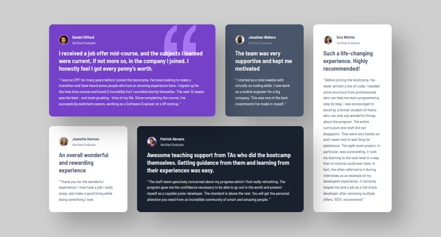
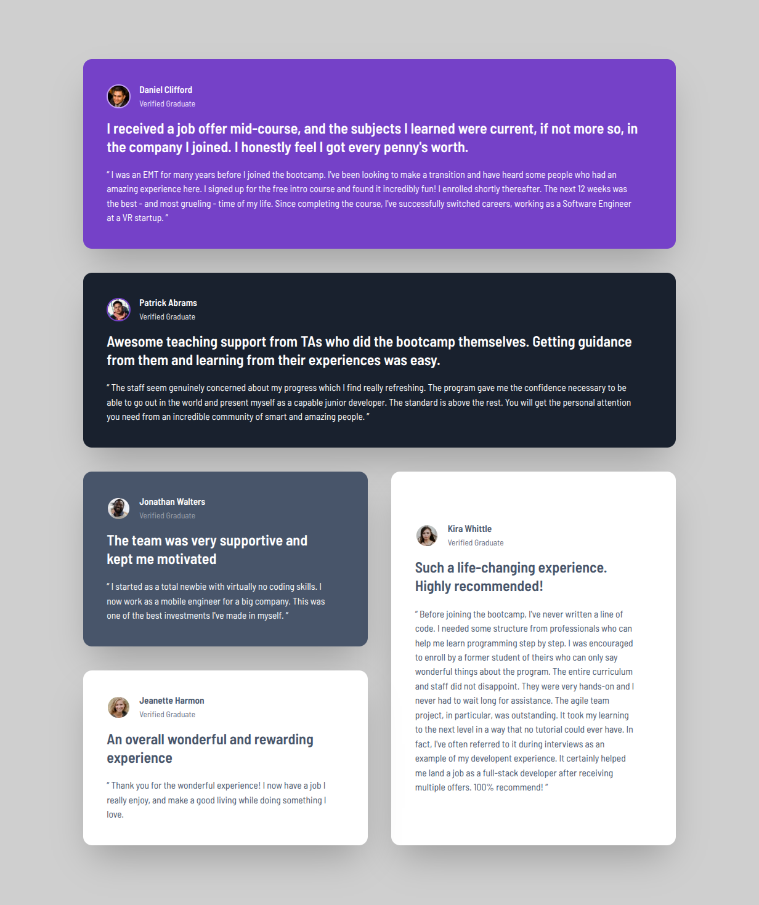
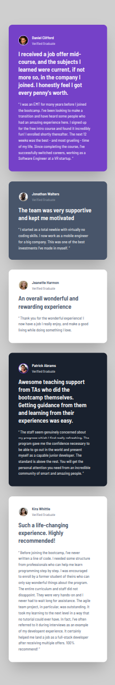

# Frontend Mentor - Testimonials grid section solution

This is a solution to the [Testimonials grid section challenge on Frontend Mentor](https://www.frontendmentor.io/challenges/testimonials-grid-section-Nnw6J7Un7). Frontend Mentor challenges help you improve your coding skills by building realistic projects. 

## Table of contents

- [Frontend Mentor - Testimonials grid section solution](#frontend-mentor---testimonials-grid-section-solution)
  - [Table of contents](#table-of-contents)
  - [Overview](#overview)
    - [The challenge](#the-challenge)
    - [Screenshot](#screenshot)
    - [Links](#links)
  - [My process](#my-process)
    - [Built with](#built-with)
    - [What I learned](#what-i-learned)
    - [Continued development](#continued-development)
    - [Useful resources](#useful-resources)
  - [Author](#author)
  - [Acknowledgments](#acknowledgments)

**Note: Delete this note and update the table of contents based on what sections you keep.**

## Overview

### The challenge

Users should be able to:

- View the optimal layout for the site depending on their device's screen size

### Screenshot





### Links

- Solution URL: [GitHub](https://github.com/Adamskiee/testimonials-grid)
- Live Site URL: [Website](https://adamskiee.github.io/testimonials-grid/)

## My process

### Built with

- Semantic HTML5 markup
- CSS custom properties
- Flexbox
- CSS Grid
- Mobile-first workflow
- [Tailwind](https://tailwindcss.com/) - CSS Framework

### What I learned

1. Position
```html
<div
class="card bg-purple-500 text-white relative lg:col-span-2"
>
    
    ...
    <h2 class="content__subject relative z-10">
        I received a job offer mid-course, and the subjects I learned were
        current, if not more so, in the company I joined. I honestly feel I
        got every penny's worth.
    </h2>
    ...
</div>
```

### Continued development

1. I want to learn more about how can I use layouts in complex projects.

### Useful resources

- [W3schools](w3schools.com) - This helped me to visualize how CSS properties works

## Author

- Frontend Mentor - [@Adamskiee](https://www.frontendmentor.io/profile/Adamskiee)

## Acknowledgments

I want to acknowledge all the user of Frontend Mentor. They gave me feedback on how can I improve.
